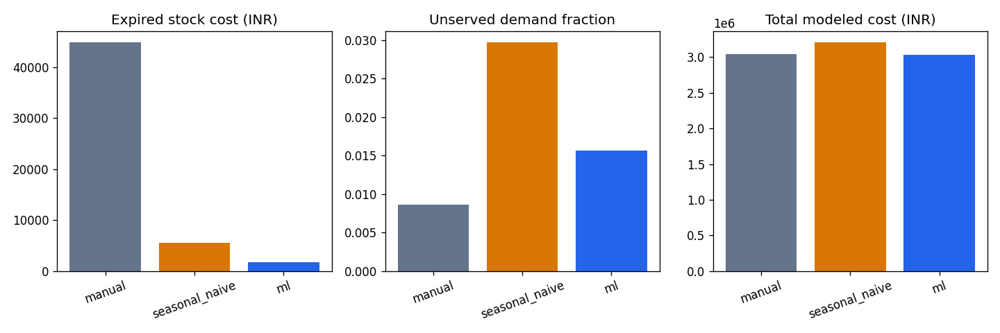

# Final project report

## Problem and deliverables

Coffee-shop purchasing balances expired ingredients against lost sales. Demand
changes with weekday, festivals, weather, promotions and gradual drift. Orders
must also respect recipes, supplier lead times, pack minimums and shelf life.

This project delivers forecasts and intervals, ingredient requirements, feasible
order proposals, a FIFO policy comparison, FastAPI and a seven-screen dashboard.
Phases 0–8 are implemented. It is a synthetic Bengaluru shop demonstration;
reported results do not establish real-business savings.

## Data

Ten items and ten materials cover 1,096 days, 2023-01-01–2025-12-31:
10,960 item-days. Seed 42 and SHA-256 item identities isolate random streams.
Mean demand combines base demand, trend, weekly/monthly seasonality, payday,
calendars, weather, promotions and a gradual shift. Negative-binomial dispersion
is 30. A mean-one lognormal shop shock (sigma 0.07) is shared across items.
Default promotion probability is 0.06 per item/day with a fixed spillover universe.

Current weather is validated historical Open-Meteo reanalysis. It drives synthetic
demand, but future realized weather is excluded from prediction inputs. Synthetic
fallback is swappable and explicitly recorded.

Observed records contain 56 missing rows, 67 injected POS outliers, 266 stockout
rows and nine closure days. Clean weekend mean is 50.66 units/item-day versus
weekday 42.30 (ratio 1.197). These descriptive patterns are not causal estimates.
Recorded units total 484,112 including outliers; uncapped demand totals 484,775.
The gap exactly reconciles to stockout loss + missing loss − outlier excess.
Exclusive status precedence is closed > missing > stockout > outlier > clean.

Observed SQLite/CSV and evaluation truth have separate files/loaders. Truth is
available for diagnostics and replay, never predictors. Publication stages and
validates outputs; handled failures roll back. Individual replacements are atomic,
but crashes across multiple files are not globally atomic. Eleven pre-1.5 backups
remain intact. [Dictionary](data_dictionary.md), [assumptions](assumptions.md).

## Method and leakage controls

Forty predictors include known calendar/festival distances, cyclical encodings,
planned price/promotions, item/category, forecast weather, lags 1/7/14/28 and
shifted rolling mean/std over 7/28 days. Fewer than 14 valid prior item days uses
past category means for cold start. Censored targets are excluded by default;
optional stockout imputation uses prior clean observations.

Features use only prior information except known plans/calendar and legitimately
issued weather forecasts. Persistence uses yesterday's weather; fixed-origin
recursion freezes that vintage and inserts predicted counts for unknown lags.
Target quality and oracle demand are not predictors. Mutation leakage tests and
protected-source scans support this contract.

Chronological unique-date splits floor 70/15/15 fractions:
train 2023-01-01–2025-02-05; validation 2025-02-06–2025-07-19;
test 2025-07-20–2025-12-31. No shuffling. Drift begins in validation and ramps
180 days to 2025-08-05; sixteen ramp days overlap test.

Five expanding training folds tune four LightGBM candidates, with preprocessing
fitted per fold. Validation chooses Ridge/LightGBM; train+validation refitting
then freezes the deployment before test scoring. Baselines are yesterday, same
weekday last week and seven-day mean. Independent LightGBM P10/P50/P90 models
are clipped nonnegative and sorted if crossed. Optional SARIMAX remains disabled.

## Forecast results

WAPE is sum absolute error divided by sum actual demand. MAE/RMSE/bias use menu
units. Scores share 1,593 clean held-out item-days.

| Model | WAPE | MAE | RMSE | Bias |
|---|---:|---:|---:|---:|
| Yesterday naive | 29.40% | 15.814 | 20.891 | -0.161 |
| Seasonal naive | 28.91% | 15.547 | 20.704 | -0.317 |
| Seven-day mean | 23.24% | 12.498 | 16.407 | -0.293 |
| Ridge | 20.67% | 11.118 | 14.643 | -0.706 |
| Selected LightGBM | 21.49% | 11.560 | 15.549 | -2.186 |
| Quantile P50 | 21.93% | 11.794 | 15.966 | -3.283 |

Selected LightGBM improves seasonal-naive WAPE **25.65% relatively**, exceeding
the 15% target. Ridge scores better on test; choosing it from that observation
would reuse the held-out set for selection. Deployment therefore stays frozen.

One-day scoring observes earlier test history. Across 23 fixed weekly origins,
seven-day recursive WAPE is 21.53% versus seasonal naive 28.83%. The protocols
answer different operational questions.

P10–P90 coverage is **74.07%**, below nominal 80%; intervals are uncalibrated.
Recursive uncertainty is conditional on a predicted history path. SHAP supplies
signed contributions and five plain-English drivers, not causal effect estimates.

Full per-item/validation scores: ../reports/model_metrics.csv; folds:
../reports/walk_forward.csv; recursion: ../reports/recursive_metrics.csv.
[Modeling contract](modeling_contract.md).

## Inventory method

Need(material, day) = sum of forecast(item, day) × recipe quantity ×
(1 + preparation wastage). Wastage applies once, and needs remain native g/ml/pcs.
Sums of item quantiles are planning proxies, not joint calibrated material quantiles.

Safety stock = z × sigma_daily × sqrt(lead time). Default normal target is 95%.
Signed same-day residuals aggregate before standard deviation to preserve
covariance; unavailable residuals use a P90–P50 normal-spread proxy.
ROP = mean daily need × lead time + safety stock.

The planner projects stock consumption and pending arrivals. ROP, pre-delivery
shortage and coverage gaps can trigger orders. Coverage begins on receipt;
the default planning horizon expands to eleven days. Supplier minimums/packs and
usable shelf life (minus one-day buffer) constrain quantity. Binding expiry caps
use receipt-window demand; longer-life caps use a mean-rate proxy. Infeasible
packs, unmet safety quantities and pre-arrival gaps remain explicit.

Public stock is usable aggregate inventory with one pending batch/material and
unknown existing lot ages. Its default is illustrative. FIFO simulation has
separate lots and multiple deliveries. No supplier purchases are placed.
[Inventory contract](inventory_contract.md).

## FIFO replay and economic results

All policies face 165 test days, 88,436 requested units, identical initial fresh
stock, supplier rules and alphabetical whole-recipe allocation. Daily events are
expiry, receipt, review/order, fulfillment and holding. Expiry occurs at receipt
date plus shelf life.

Forecasts refresh weekly, with daily inventory reviews. Origins use common prior
factual POS history; evaluation truth enters after the forecast bank is frozen.
Manual orders the previous-week mean plus 20% buffer with supplier rounding.
Forecast policies also apply expiry caps. Seasonal sigma uses prior lag-seven
residuals, while ML uses uncalibrated quantile spread. This compares complete
ordering policies, not just point forecast models.

| Policy | Service | Lost units | Unserved demand | Expiry INR | Holding INR | Gross cost INR |
|---|---:|---:|---:|---:|---:|---:|
| Manual | 99.14% | 762 | 0.86% | 44,868.33 | 15,726.36 | 3,042,230.92 |
| Seasonal naive | 97.03% | 2,626 | 2.97% | 5,539.00 | 12,609.57 | 3,206,115.12 |
| ML | 98.44% | 1,383 | 1.56% | 1,731.45 | 11,675.49 | 3,035,995.04 |

ML expiry cost is **96.14% lower than manual**, but lost units are **81.50% higher**.
Compared with seasonal naive, it loses 47.33% fewer units and wastes about 68.74%
less by cost. Forecast accuracy does not automatically improve every stock metric.

Additional ML losses concentrate in food: croissant 706 versus manual 310;
sandwich 457 versus 232. Beverage lost counts match. This is consistent with
perishable capacity/pack tradeoffs, not proof of a single causal mechanism.

Gross cost = initial stock + purchase commitments + end-day holding +
lost-sales penalty. Waste procurement is already included and not added twice.
The ML gross-cost advantage over manual is only **0.205%**. With full closing-stock
and pending-value credit, manual is INR 2,907,610.16 and ML INR 2,933,440.80,
reversing the ranking by INR 25,830.64. This sensitivity is not a liquidation
forecast. Assumed economics do not substantiate robust savings.

No test-outcome policy/generator tuning was performed. Native waste quantities
are reported separately per material; g/ml/pcs are not summed.
[Simulation contract](simulation_contract.md).

## API and dashboard

FastAPI exposes eight operations on seven paths, strict Pydantic validation,
422/409/503 errors and Swagger/OpenAPI. Models load lazily. Inventory updates use
expected_version, a process lock and atomic separate JSON publication; multiple
independent writers are unsupported. Scenarios change isolated weather/plans.

The seven dashboard screens provide forecasts, native-unit coverage, supplier
proposals/CSV, SHAP/training patterns, real saved metrics and what-if comparison.
Local service mode needs no API; HTTP mode shares the API inventory lock.
Stale forms require Reload stock. The header shows a fixed demo date and
illustrative stock; plots show prior valid counts plus future forecasts, not
unavailable future actuals. [API contract](api_contract.md),
[dashboard guide](dashboard_guide.md), [slide outline](slide_outline.md),
[demo script](demo_script.md).

## Quality and limitations

Final verification passed 217 tests (15 dependency deprecation warnings),
Ruff lint, formatting for 62 files and dependency checks. All 22 direct pins match
the installed environment.
It regenerates the full-size data, EDA, models, inventory and 165-day replay into
empty temporary outputs through the Windows wrapper and existing venv. Validated
historical weather keeps the rebuild offline. Model selection/WAPE and all policy
summary numbers are compared with saved results; real API/dashboard CLI startups,
saved notebook schema/no-error validation and original-file hashes are checked.
All 42 original data/model/figure/notebook files and eleven pre-1.5 backups
retain their hashes. Complete transcript: ../reports/phase_8_verification.txt
and ../PROGRESS.md.

A fresh pip installation and GNU Make execution are not independently verified
on this host. Where Windows sandbox restrictions block atomic writes or loopback,
approved verification access is needed. Weather outage/recovery tests use mocks.
Existing demo outputs remain untouched.

Limitations include synthetic customers, assumed prices/storage/suppliers,
unmodeled operational weather delays/errors, common POS history instead of
policy-dependent feedback, alphabetical allocation, uncalibrated intervals,
unknown public stock ages, no cost confidence intervals, single-process JSON
and no authentication. Lunar coverage ends in 2026. This is a local college demo.

## Future work

Collect consented POS, waste, deliveries and lot-age records; evaluate on a newly
reserved chronological period. Calibrate multi-step intervals and measure weather
forecast errors. Compare policies under equal expiry rules to isolate forecast
value from policy differences. Evaluate uncertain lead times, food service targets,
packs and terminal values across seeds/scenarios without tuning on this test.

Add transactional lot inventory, authentication, reconciliation, monitoring,
reviewed calendars and prospective drift/retraining checks before multiuser use.
A closed-loop replay and live pilot are prerequisites for real-shop savings claims.
