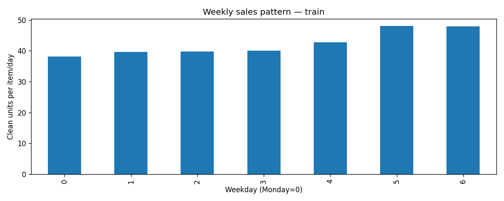
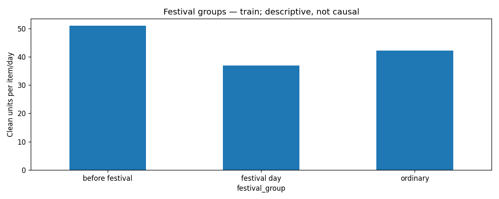
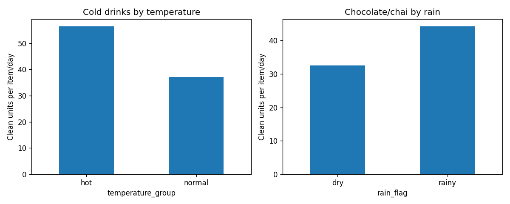
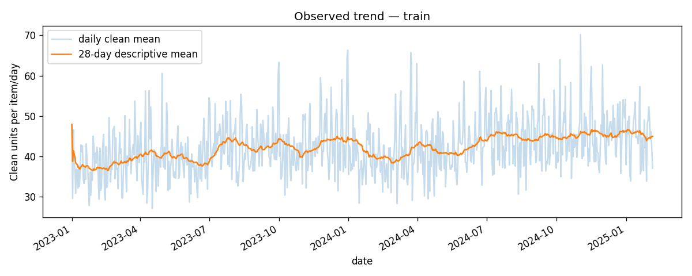
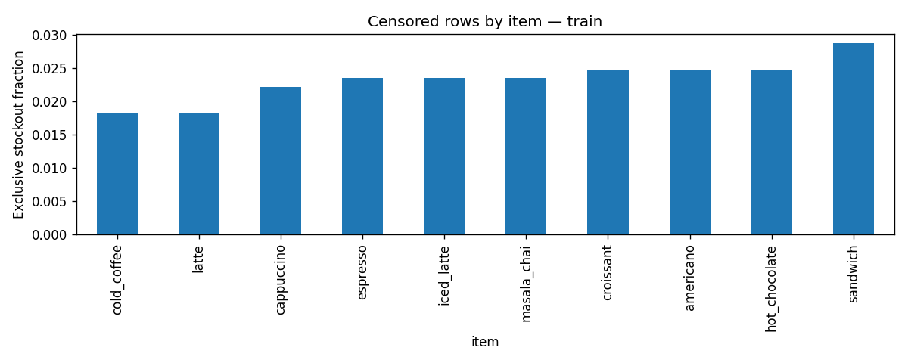

# Phase 2 exploratory data analysis

Scope: train, 2023-01-01 to 2025-02-05.
Rows: 7670; clean rows: 7326.
Synthetic sales; historical realized weather; group differences are confounded. EDA uses train dates by default.

Plots use observed weather for descriptive EDA only. Forecast predictors use lagged persistence weather.
Rolling trend lines here summarize observations; they are not model predictors.
Historical feature exports are for rolling one-day-ahead evaluation. Fixed-origin multi-day evaluation must use build_prediction_features and recursive predictions.

## Plots

### weekly

### festival

### weather

### trend

### stockouts

