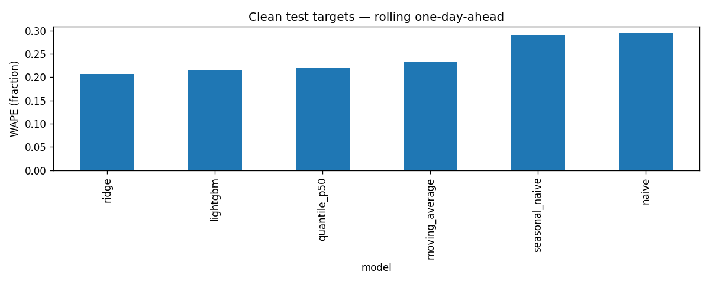
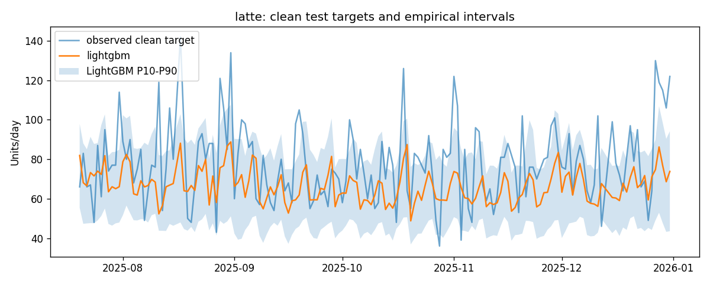
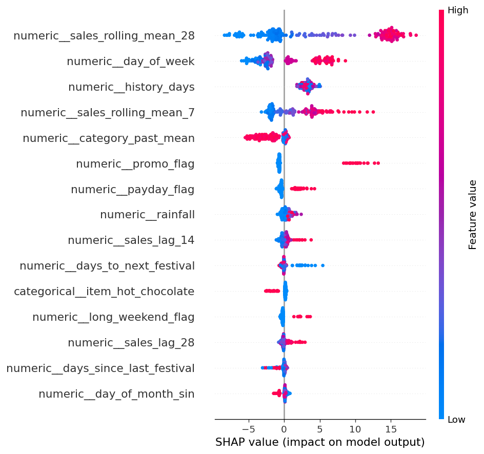

# Phase 3 modeling results

Selected on validation: **lightgbm**. Saved model trained through 2025-07-19.
Clean one-day test rows: 1593.
Relative WAPE improvement over seasonal naive: 25.65%; requested 15% achieved: True.

## Overall clean test metrics

| Model | WAPE | MAE | RMSE | Bias | Coverage |
|---|---:|---:|---:|---:|---:|
| ridge | 0.2067 | 11.118 | 14.643 | -0.706 | n/a |
| lightgbm | 0.2149 | 11.560 | 15.549 | -2.186 | n/a |
| naive | 0.2940 | 15.814 | 20.891 | -0.161 | n/a |
| seasonal_naive | 0.2891 | 15.547 | 20.704 | -0.317 | n/a |
| moving_average | 0.2324 | 12.498 | 16.407 | -0.293 | n/a |
| quantile_p50 | 0.2193 | 11.794 | 15.966 | -3.283 | 0.741 |

Full per-item and validation metrics: model_metrics.csv.
Train-only expanding fold results and parameters: walk_forward.csv.
Fixed-origin horizon metrics: recursive_metrics.csv.

## Interpretation

Baseline errors contain day-to-day count noise. ML combines known calendar/promotion effects and smoother prior history.
The shared daily shock, count noise, drift and imperfect persistence weather remain unpredictable components.
All model/parameter decisions were frozen before test scoring. No test-driven tuning or generator changes were made.
Raw quantile crossing rows: 0; crossings are repaired by sorting and coverage measured afterward.

## Limits

- Synthetic shop data; no real-shop generalization claim.
- Persistence weather is less informative than future realized weather, deliberately excluded.
- One-day scores use earlier observed test history; recursive scores use predictions.
- Quantile intervals are empirical and uncalibrated; recursive uncertainty is conditional on a predicted history path.
- Cold-start point forecasts use past category means; quantile fallback uses training-category empirical quantiles.
- SHAP drivers are model associations, not causal effects.

## Charts

