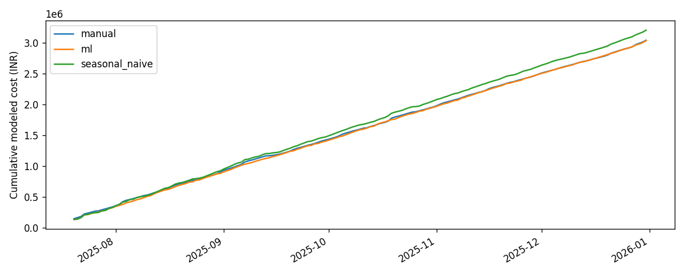

# Phase 5 policy simulation

Test dates: 2025-07-20 through 2025-12-31 (165 days).

| Policy | Service | Stockout units rate | Waste INR | Holding INR | Total cost INR |
|---|---:|---:|---:|---:|---:|
| manual | 99.14% | 0.86% | 44868.33 | 15726.36 | 3042230.92 |
| seasonal_naive | 97.03% | 2.97% | 5539.00 | 12609.57 | 3206115.12 |
| ml | 98.44% | 1.56% | 1731.45 | 11675.49 | 3035995.04 |

## Measured comparisons

seasonal_naive relative reductions vs manual: waste_cost: 87.65%, stockout_rate: -244.62%, total_cost: -5.39%. Negative values mean worse.
ml relative reductions vs manual: waste_cost: 96.14%, stockout_rate: -81.50%, total_cost: 0.20%. Negative values mean worse.

## Interpretation and limits

All policies face identical evaluation demand, initial fresh stock, suppliers and FIFO allocation.
Forecasts refresh weekly from common historical observed POS records; simulated lost sales do not feed future predictors. This isolates the inventory decision comparison but omits policy-dependent observation feedback.
Manual: last week's valid average with a 20% configured buffer and supplier rounding, without a demand-based expiry cap. Forecast policies use the Phase 4 trigger/cap rules, extended for lots and multiple receipts.
Seasonal-naive sigma comes from past aggregate lag-seven residuals; ML sigma uses its uncalibrated P90-P50 spread. These compare complete policies, not only point forecasts.
Whole items are served in alphabetical menu order when materials are scarce; no partial recipe consumption or substitutions.
Expiry is discarded at start of receipt_date + shelf_life_days. Preparation wastage is included once in recipe consumption.
Total cost = initial stock value + purchases + holding + lost-sales penalty. Waste cost is already embedded in stock purchases and is not added again.
Terminal stock and undelivered pipeline value are reported separately; no salvage is assumed. Orders near the end may arrive outside the replay.
Native waste units are reported per material; g, ml and pcs are never summed into one unit metric.
Synthetic results do not establish real-shop savings. Parameters were frozen before replay and were not tuned to force improvement.

